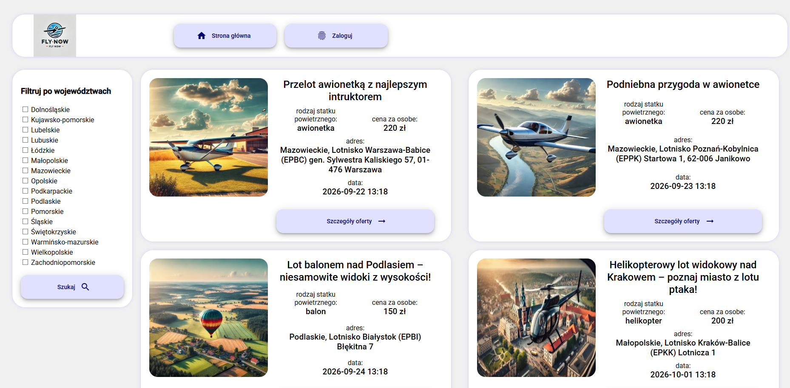
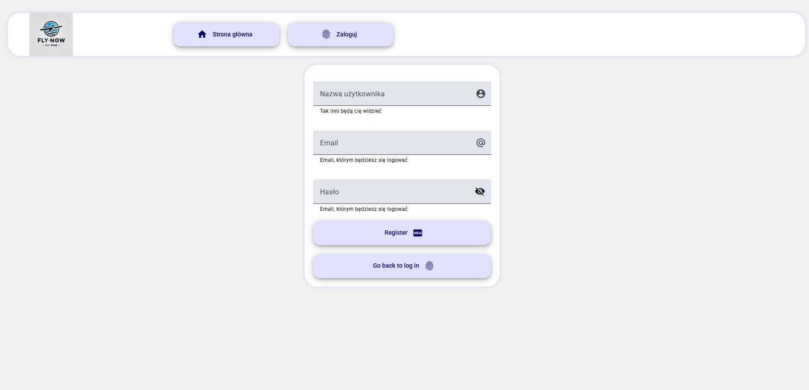
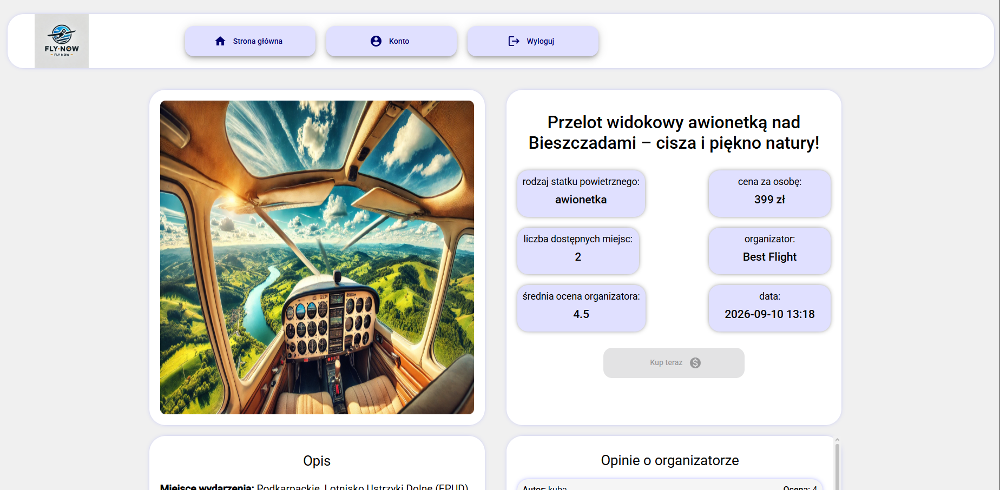
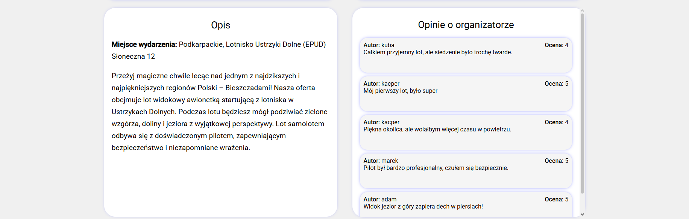
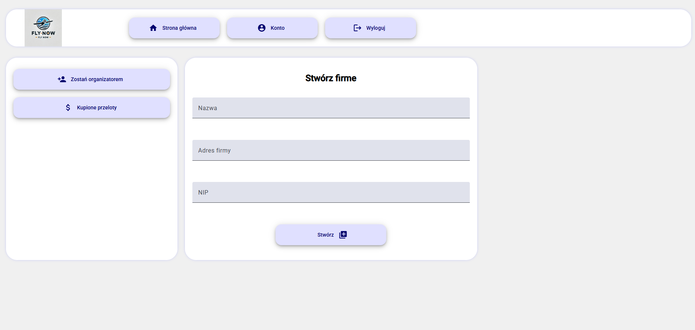

# FlyNow (front-end)

FlyNow was engineering thesis project that solves problem of connecting pilots with clients. Everyone can book flight or become organizer and offer others flights.

## Overview

Main purpose of project was to create web application that specifically (and only) helps people find sightseeing flights offers.
Unlike many others it focuses clearly on aviation part of business instead of aggregating all types of market offers.

## Technologies for front-end

* Angular (v18)
* Docker
* JWT
App is secured with custom AuthGuards that retrieve request and check if user has required claims in JWT Token.
Some router paths have custom data attached with RoleEnum values to prevent certain endpoints from unauthorized users.

## Features

* Logging/registering
* Filtering offers and checking details
* Buying, creating company and offers
* Comment and rating system

## Screenshots

### Main View



### Register panel



### Offer details (1/2)



### Offer details (2/2)




### Account menu - create company submenu



## Getting Started

### Requirements
Angular v18 or docker supporting linux
npm

### Installation & running locally
Check src/environments/environment.development.ts, as it is configured for default spring boot local port. (Check backend https://github.com/PaawllooPL/FlyNowPlatform-backend.git)
```bash
git clone https://github.com/PaawllooPL/FlyNowPlatform-frontend.git
cd FlyNowPlatform-frontend
npm run start
```

## Project Structure

Main source code is divided into components, dto, models, pages (utilizing components) and services. 

## Author

PaawllooPL(https://github.com/PaawllooPL)
